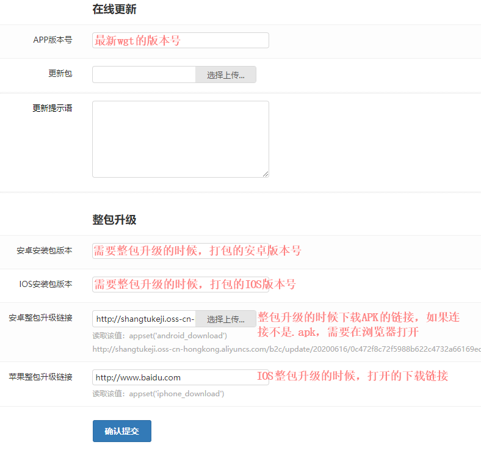

# APP升级文档

## 升级方式： 
 - 热更新
 - 整包升级(AndroidAPK)
 - 打开下载页下载升级

## 相关代码
   - pages.json: 设置升级页面 /pages/basic/upgrade
   - pages/basic/upgrade.vue: 升级页面相关代码
   - store/modules/upgrade.js: 升级控制逻辑相关代码
   - pages/login/login.vue、pages/home.vue: 在需要升级的页面里执行升级检查

## 步骤
 1. 在需要升级的页面执行升级检查, this.$store.dispatch('upgrade/check')
 2. 升级检查会获取服务器设置的升级配置，先检查是否需要整包更新，需要整包更新就执行整包升级逻辑， 否则检查是否需要热更新，需要则执行热更新逻辑
 3. 最终在更新之前会检查升级链接， wgt、apk结尾的链接会下载然后安装，其他链接直接打开页面

## 服务器配置： http://t项目编号.shangtua.com/manage/index/index?isweifu=6
  
  